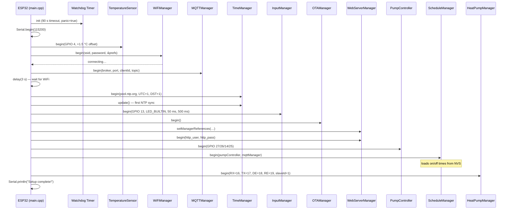
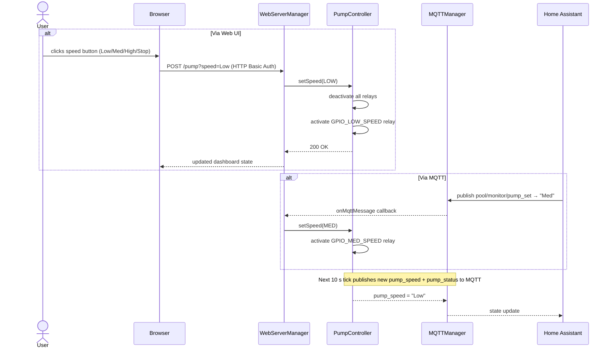

# Pool Monitor — Project Wiki

> **ESP32-based pool pump and heat pump monitoring & control system.**  
> Current release: **v2.1.0** · Hardware: ESP32 + DS18B20 + MAX485 RS485 transceiver

---

## Table of Contents

1. [Project Overview](#project-overview)
2. [Project Status](#project-status)
3. [System Architecture](#system-architecture)
4. [Sequence Diagrams](#sequence-diagrams)
   - [Boot & Initialisation](#boot--initialisation)
   - [Normal Operation Loop](#normal-operation-loop)
   - [Pump Control (Web / MQTT)](#pump-control-web--mqtt)
   - [Heat Pump Modbus Polling](#heat-pump-modbus-polling)
   - [OTA Firmware Update](#ota-firmware-update)
5. [Hardware Overview](#hardware-overview)
6. [MQTT Topics](#mqtt-topics)
7. [Home Assistant Integration](#home-assistant-integration)
8. [Configuration Quick-Reference](#configuration-quick-reference)

---

## Project Overview

Pool Monitor turns an **ESP32** into a smart pool controller that:

| Capability | Detail |
|---|---|
| **Pump control** | Sets pool pump speed (Low / Med / High / Stop) via web UI or MQTT |
| **Temperature sensing** | DS18B20 one-wire sensor, published every 10 s |
| **Heat pump read-out** | Modbus RTU (RS485) polling of Welldana PMH / Fairland IPHCR — temperatures, power state, mode, error code |
| **Web dashboard** | Responsive UI with 5 colour themes, animated pool-water effects, HTTP auth |
| **Home Assistant** | Full MQTT auto-discovery for all sensors and binary sensors |
| **Scheduling** | Configurable daily on/off times, stored in NVS |
| **OTA updates** | ArduinoOTA with pump-safe guard — operations suspended during transfer |

---

## Project Status

### Feature Matrix

| Feature | Status | Since |
|---|---|---|
| Pool pump control (Low/Med/High/Stop) | ✅ Stable | v1.0 |
| DS18B20 temperature sensor | ✅ Stable | v1.0 |
| MQTT publish | ✅ Stable | v1.0 |
| Daily schedule (on/off time) | ✅ Stable | v1.0 |
| Web dashboard | ✅ Stable | v1.0 |
| Modular manager-based architecture | ✅ Stable | v2.0 |
| 5 colour themes + animated water UI | ✅ Stable | v2.0 |
| Home Assistant MQTT auto-discovery | ✅ Stable | v2.0 |
| OTA protection (no pump ops during update) | ✅ Stable | v2.0 |
| WiFi auto-reconnect with watchdog | ✅ Stable | v2.0 |
| NVS persistent settings | ✅ Stable | v2.0 |
| Heat pump Modbus read-out (RS485) | ✅ Stable | v2.1 |
| Heat pump telemetry → MQTT + HA | ✅ Stable | v2.1 |
| Heat pump write control via MQTT | 🔲 Planned | — |
| Heat pump controls in web UI | 🔲 Planned | — |

### Known Issues

| Issue | Resolution |
|---|---|
| OTA upload fails over weak WiFi | Documented — move AP closer or use serial upload once |
| Schedule not saving (pre-v2.0) | Fixed in v2.0 — proper `ScheduleManager::begin()` init |
| Theme switcher broken (pre-v2.0) | Fixed in v2.0 — updated CSS class names in JS |

---

## System Architecture

The firmware follows a **manager-based** (component) architecture. `main.cpp` owns one instance of each manager, calls `begin()` in `setup()`, and calls `handle()` / `update()` / `poll()` in `loop()`.

```
┌──────────────────────────────────────────────────────────┐
│                        main.cpp                          │
│  setup() ──► begin() each manager                        │
│  loop()  ──► handle/update/poll each manager             │
└───────────────────────────┬──────────────────────────────┘
                            │ owns
        ┌───────────────────┼────────────────────────┐
        │                   │                        │
  WiFiManager         MQTTManager            OTAManager
  (reconnect/         (publish,              (ArduinoOTA,
   watchdog)          HA discovery)          update guard)
        │
  TimeManager         WebServerManager ──► PumpController
  (NTP sync)          (HTTP auth,           (GPIO relay
                       AJAX routes)          control)
  TemperatureSensor   ScheduleManager ──► PumpController
  (DS18B20 one-wire)  (daily on/off,
                       NVS persist)
  InputManager        HeatPumpManager
  (button, LED)       (Modbus RTU,
                       RS485 / MAX485)
```

### Module Summary

| Manager | File | Responsibility |
|---|---|---|
| `WiFiManager` | `WiFiManager.*` | Connect, auto-reconnect, 5-retry watchdog reset |
| `MQTTManager` | `MQTTManager.*` | Publish telemetry, subscribe to commands, HA discovery |
| `OTAManager` | `OTAManager.*` | ArduinoOTA with update-guard flag |
| `PumpController` | `PumpController.*` | GPIO relay control for pump speed selection |
| `ScheduleManager` | `ScheduleManager.*` | Daily on/off schedule read/write from NVS |
| `TemperatureSensor` | `TemperatureSensor.*` | DS18B20 one-wire read with calibration offset |
| `TimeManager` | `TimeManager.*` | NTP sync, validity flag, hour getter |
| `WebServerManager` | `WebServerManager.*` | ESPAsyncWebServer routes, HTML dashboard, HTTP auth |
| `InputManager` | `InputManager.*` | Debounced button read, status LED blink |
| `HeatPumpManager` | `HeatPumpManager.*` | Modbus RTU over RS485, self-rate-limited polling, cached getters |

---

## Sequence Diagrams

### Boot & Initialisation



---

### Normal Operation Loop

```mermaid
sequenceDiagram
    participant Loop as loop()
    participant OTA as OTAManager
    participant WiFi as WiFiManager
    participant MQTT as MQTTManager
    participant Time as TimeManager
    participant Input as InputManager
    participant Sensor as TemperatureSensor
    participant HP as HeatPumpManager
    participant Sched as ScheduleManager
    participant WDT as Watchdog Timer

    loop Every ~1 ms
        Loop->>OTA: handle()
        alt OTA update in progress
            Loop->>WDT: reset()
            Loop-->>Loop: return (all other work suspended)
        end

        Loop->>WiFi: handle()
        Note over WiFi: process reconnect / restart flags

        alt WiFi connected
            Loop->>MQTT: handle()
            Note over MQTT: reconnect if needed, process callbacks
        end

        Loop->>Time: update()
        Loop->>Input: update()
        Note over Input: debounce button, blink LED

        Loop->>WiFi: getRSSI() → rssi
        alt rssi ≠ 0
            Loop->>WDT: reset()
        end

        alt millis() − lastDallasRead > 10 000 ms
            Loop->>Sensor: readTemperature()
            Loop->>Loop: publishStatusToMQTT()
            Note over Loop: publishes temp, rssi, speed,<br/>pump_status, ip + heat-pump telemetry
        end

        Loop->>HP: poll()
        Note over HP: rate-limited — hits Modbus bus once per 5 s

        alt millis() − lastLoopDelay ≥ 500 ms
            alt Time is valid (NTP synced)
                Loop->>Sched: checkAndExecute(hour)
                Note over Sched: auto start/stop pump at scheduled times
            end
        end
    end
```

---

### Pump Control (Web / MQTT)



---

### Heat Pump Modbus Polling

```mermaid
sequenceDiagram
    participant Loop as loop()
    participant HP as HeatPumpManager
    participant MB as ModbusMaster (UART2)
    participant MAX485 as MAX485 Transceiver
    participant Pump485 as Heat Pump (slave ID 1)
    participant MQTT as MQTTManager
    participant HA as Home Assistant

    Loop->>HP: poll()

    alt now − lastPoll < 5 000 ms
        HP-->>Loop: (rate-limited, skip)
    end

    HP->>MAX485: DE=HIGH (transmit mode)
    HP->>MB: readCoils(0, 1) — power on/off
    MB->>MAX485: Modbus request frame
    MAX485->>Pump485: RS485 A/B differential
    Pump485-->>MAX485: response
    MAX485-->>MB: received frame
    MB-->>HP: coil value (power)
    HP->>MAX485: DE=LOW (receive mode)

    HP->>MB: readInputRegisters(2000, 4) — error + 3 temps
    MB-->>HP: inlet / outlet / ambient temp (×10 → °C)

    HP->>MB: readHoldingRegisters(3000, 3) — target, mode, silence
    MB-->>HP: target temp, operation mode, silence mode

    HP->>HP: cache all values + set lastUpdate = millis()

    Note over Loop,HP: 10 s tick fires in loop()
    Loop->>MQTT: publishStatusToMQTT()
    MQTT->>MQTT: read cached getters from HP
    MQTT->>HA: heatpump/inlet_temp, outlet_temp, ambient_temp,<br/>target_temp, power, mode, silence, error, online
```

---

### OTA Firmware Update

```mermaid
sequenceDiagram
    actor Dev as Developer
    participant PIO as PlatformIO / Arduino IDE
    participant OTA as OTAManager
    participant Pump as PumpController
    participant Loop as loop()
    participant WDT as Watchdog Timer

    Dev->>PIO: platformio run --target upload --upload-port <IP>
    PIO->>OTA: ArduinoOTA start (mDNS / UDP)
    OTA->>OTA: setUpdating(true)

    Note over Loop: Next loop() iteration detects isUpdating()
    Loop->>WDT: reset() only
    Loop-->>Loop: return immediately (all managers suspended)

    loop OTA data transfer
        PIO->>OTA: send firmware chunk
        OTA->>WDT: reset()
    end

    OTA->>OTA: flash written, verify checksum
    OTA->>OTA: setUpdating(false)
    OTA->>OTA: ESP.restart()
    Note over Loop,Pump: Device reboots — pump returns to Stop state
```

---

## Hardware Overview

```
                    ┌──────────────────────────────────┐
                    │          ESP32 DevKit V1          │
                    │                                  │
   DS18B20 ─────────┤ GPIO 4  (one-wire data)          │
   4.7 kΩ to 3.3 V  │                                  │
                    │ GPIO 13 (button input)     ───────┤ Push button (to 3.3V)
                    │                                  │
                    │ GPIO 14 (relay Med speed)  ───────┤ Pool pump relay board
                    │ GPIO 26 (relay Low speed)  ───────┤
                    │ GPIO 27 (relay High speed) ───────┤
                    │ GPIO 25 (relay Stop)       ───────┤
                    │                                  │
                    │ GPIO 16 (UART2 RX / RO)    ───────┤ MAX485 RO
                    │ GPIO 17 (UART2 TX / DI)    ───────┤ MAX485 DI
                    │ GPIO 18 (RS485 DE)         ───────┤ MAX485 DE
                    │ GPIO 19 (RS485 !RE)        ───────┤ MAX485 !RE
                    │                                  │
                    │ LED_BUILTIN (status LED)          │
                    └──────────────┬───────────────────┘
                                   │ WiFi (802.11 b/g/n)
                              ┌────▼────┐
                              │ Router  │
                              └────┬────┘
                       ┌───────────┼───────────┐
                  ┌────▼───┐  ┌────▼────┐  ┌───▼────────────┐
                  │ Browser│  │  MQTT   │  │ Home Assistant │
                  │ Web UI │  │ Broker  │  │ (auto-discover)│
                  └────────┘  └─────────┘  └────────────────┘

MAX485 ──[A/B]──► Heat Pump RS485 bus (Welldana PMH / Fairland IPHCR)
```

---

## MQTT Topics

Base topic configured in `platformio.ini` (default `pool/monitor`).

### Published by ESP32

| Topic | Payload | Notes |
|---|---|---|
| `pool/monitor/temperature` | `27.40` | Pool water °C, every 10 s |
| `pool/monitor/rssi` | `-58` | WiFi signal dBm |
| `pool/monitor/pump_speed` | `Low` / `Med` / `High` / `Stop` | Current speed |
| `pool/monitor/pump_status` | `on` / `off` | Binary — anything ≠ Stop = on |
| `pool/monitor/status` | `1` / `0` | System OK / Error |
| `pool/monitor/ip` | `192.168.0.163` | Device IP |
| `pool/monitor/heatpump/inlet_temp` | `27.4` | °C (after successful Modbus poll) |
| `pool/monitor/heatpump/outlet_temp` | `28.9` | °C |
| `pool/monitor/heatpump/ambient_temp` | `21.0` | °C |
| `pool/monitor/heatpump/target_temp` | `28.0` | °C |
| `pool/monitor/heatpump/power` | `ON` / `OFF` | Heat pump power state |
| `pool/monitor/heatpump/mode` | `0` / `1` / `2` | Auto / Heat / Cool |
| `pool/monitor/heatpump/silence` | `0` / `1` / `2` | Smart / Silence / Super Silence |
| `pool/monitor/heatpump/error` | `0` | Error code (0 = no error) |
| `pool/monitor/heatpump/online` | `1` / `0` | Modbus link health |

### Home Assistant Discovery

| Prefix | Entities |
|---|---|
| `homeassistant/sensor/poolmonitor_*` | temperature, rssi, pump_speed, ip, hp_inlet/outlet/ambient/target_temp, hp_mode, hp_silence, hp_error |
| `homeassistant/binary_sensor/poolmonitor_*` | status, pump_status, hp_power, hp_online |

---

## Home Assistant Integration

The device auto-discovers under the **PoolMonitor** device in Home Assistant. No manual YAML configuration is needed.

**Pool entities:**
- `sensor.poolmonitor_temperature` — Pool water temperature (°C)
- `sensor.poolmonitor_rssi` — WiFi RSSI (dBm)
- `sensor.poolmonitor_pump_speed` — Text speed label
- `binary_sensor.poolmonitor_pump_status` — Running / Stopped
- `binary_sensor.poolmonitor_status` — System OK / Problem
- `sensor.poolmonitor_ip` — Device IP

**Heat pump entities (read-only):**
- `sensor.poolmonitor_hp_inlet_temp` / `_outlet_temp` / `_ambient_temp` / `_target_temp`
- `binary_sensor.poolmonitor_hp_power` — On / Off
- `sensor.poolmonitor_hp_mode` — Auto / Heat / Cool
- `sensor.poolmonitor_hp_silence` — Smart / Silence / Super Silence
- `sensor.poolmonitor_hp_error` — Error code
- `binary_sensor.poolmonitor_hp_online` — Modbus link (problem class)

> Heat pump *write* controls (switch, number, select) are **not** advertised yet — the integration is intentionally read-only in v2.1. See [HEATPUMP.md](HEATPUMP.md) for the roadmap.

---

## Configuration Quick-Reference

### 1. Credentials (`src/cred.h` — gitignored)

```cpp
#define SS_ID       "your-wifi-ssid"
#define auth        "your-wifi-password"
#define HTTP_USER   "admin"
#define HTTP_PASS   "your-web-password"
#define MQTT_USER   "mqtt-username"   // optional
#define MQTT_PASS   "mqtt-password"   // optional
```

### 2. MQTT Broker (`src/main.cpp`)

```cpp
#define MQTT_HOST  "192.168.0.54"
#define MQTT_PORT  1883
```

### 3. Build environments (`platformio.ini`)

| Environment | MQTT client ID | MQTT topic |
|---|---|---|
| `production` | `PoolMonitor` | `pool/monitor` |
| `test` | `PoolMonitor_Test` | `pool/monitor/test` |

### 4. Flash & upload

```bash
# Production device
platformio run --target upload --environment production

# Test device
platformio run --target upload --environment test

# OTA (production)
platformio run --target upload --environment production --upload-port 192.168.0.163
```

---

*Made with ❤️ for pool automation — [repository](https://github.com/tipih/poolMonitor)*
